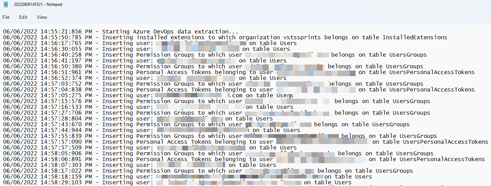
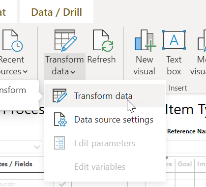
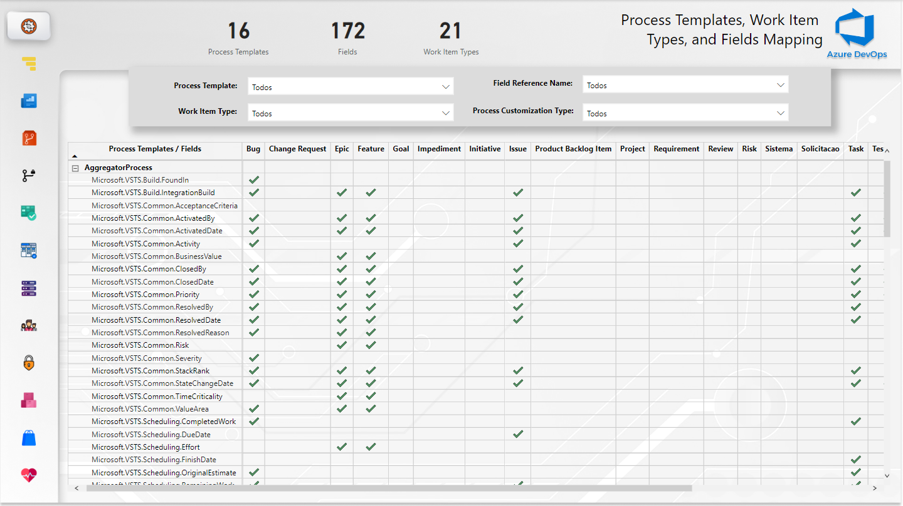

# Azure DevOps Management Reports
Data extraction and Power BI report that generate management informations about your Azure DevOps organization. Using [Azure DevOps CLI](https://docs.microsoft.com/en-us/azure/devops/cli/?view=azure-devops) and [Azure DevOps REST API](https://docs.microsoft.com/en-us/rest/api/azure/devops/?view=azure-devops-rest-7.1), PowerShell scripts extract data from [Azure DevOps](https://azure.microsoft.com/en-us/services/devops/), store this information in an Azure SQL Database and shows them in a Power BI report.


## Azure DevOps Management Reports
This project aims to extract management information (Processes, Projects, Repos, Build and Release Defintions, etc.) from Azure DevOps and present it in a single report.

## Get started - Configure Azure DevOps Management Reports

### Create Azure SQL Database
This extraction needs it to be created an Azure SQL Server and Database to store the information extracted by running the PowerShell scripts

This tutorial helps you to create this database:
[Quickstart: Create an Azure SQL Database single database](https://docs.microsoft.com/en-us/azure/azure-sql/database/single-database-create-quickstart?tabs=azure-portal)

|Database Name|
|---|
|azuredevopsreports|

After creating the database, please access SQL Server Management Studio, connect **azuredevopsreports** database and run **01_CreateTables.sql** contained in the **SQLScripts** folder. This file will create the database tables.

```sql
01_CreateTables.sql
```


### Run PowerShell Scripts
Install Module SqlServer

To run scripts, it's necessary to install the [ SQL Server PowerShell module](https://docs.microsoft.com/en-us/sql/powershell/download-sql-server-ps-module?view=sql-server-ver16)

  ```powershell
  Install-Module -Name SqlServer -Force
  ```

Install Azure DevOps Extension

To run scripts, it's necessary to install [Azure DevOps Extension for Azure CLI](https://github.com/Azure/azure-devops-cli-extension)

- [Install the Azure CLI](https://docs.microsoft.com/cli/azure/install-azure-cli). You must have at least `v2.0.69`, which you can verify with `az --version` command.
- Add the Azure DevOps Extension 
  
  ```powershell
  az extension add --name azure-devops
  ```
> After creating the database, you will need three information to run scripts:

> - Name of **Azure DevOps organization**
> - **PAT (Personal Access Token)** - To create PAT on your Azure DevOps organization, access [Create a PAT](https://docs.microsoft.com/en-us/azure/devops/organizations/accounts/use-personal-access-tokens-to-authenticate?view=azure-devops&tabs=Windows#create-a-pat) link. Important: Give a **Full access** scope to this PAT.
> - **Connection String** - Get the connection string from the **Azure SQL Database** created in the previous step

Please clone this repository and access **AllReports\PowerShell** folder

```PowerShell
cd .\AllReports\PowerShell
```

After that, executes a file **Process.ps1** on PowerShell or Visual Studio Code

```powershell
.\Processes.ps1 -PAT {{PAT}} -Organization {{Organization}}  -Connstr {{Connection string from database}}
```

At the end of execution, a log file will be generated showing all the data extraction performed.




### Configure Power BI Report
- Open **OneReportToRuleThemAll.pbix** file which is located in the **PowerBI** folder. On the **Home** tab, select **Transform data**:
  
  

- On **Queries** pane, select **Repositories** table:
  
  
  
- On **Query Settings** pane, click on **configurations**

  


- On **SQL Server database**, enter the **database server name** and the **database name**.
  - Server: {{mysqlserver}}.database.windows.net:1433
  - Database (optional): azuredevopsreports
  
  


- On **SQL Server database**, Database tab, enter **user name** and **password** to access SQL Database:
  
  

- On **Home** tab, Click on **Close & Apply**
## Access and explore Report Features
After **Power BI configuration**, you will have access to a lot of information about your Azure DevOps organization.



- Azure Boards
  - [Team Settings](https://vinijmoura.medium.com/how-to-team-settings-mapping-on-azure-devops-ee609d217a3a)
  - [Team Board Columns and Swimlanes](https://vinijmoura.medium.com/how-to-board-columns-and-swimlanes-mapping-on-azure-devops-bd7fbf94e43f)
- Azure Repos
  - [Azure Repos Health Check](https://vinijmoura.medium.com/how-to-azure-repos-health-check-on-azure-devops-5b0322c7295c)
  - [Branch Policies](https://vinijmoura.medium.com/how-to-viewing-which-repositories-have-branch-policies-on-azure-devops-c9bfb370401e)
- Process
  - [Process Templates, Work Item Types and Fields Mapping](https://vinijmoura.medium.com/how-to-process-templates-work-item-types-and-fields-mapping-on-azure-devops-dc03ea31debe)
  - [Process Templates and Projects](https://vinijmoura.medium.com/how-to-list-all-process-templates-and-respective-team-projects-on-azure-devops-1a2177ef0ba1)
- General
  - [Project Stats](https://vinijmoura.medium.com/how-to-project-stats-mapping-on-azure-devops-63ca0f0d4ca)
  - Users Access Levels and Group Permissions
    - [Users and Group Permissions](https://vinijmoura.medium.com/how-to-list-all-users-and-group-permissions-on-azure-devops-using-azure-devops-cli-54f73a20a4c7)
    - [Users and Access Levels](https://vinijmoura.medium.com/how-to-list-all-users-access-levels-on-azure-devops-b98593bb123c)
  - [Azure DevOps Services Health](https://vinijmoura.medium.com/how-to-azure-devops-service-health-using-maps-in-power-bi-711bb7c657c2)
  - [Personal Access Tokens Expiration Mapping](https://vinijmoura.medium.com/how-to-personal-access-tokens-expiration-mapping-5630e5db1f99)
  - [Installed Extensions](https://vinijmoura.medium.com/how-to-list-installed-extensions-on-azure-devops-7ee7b7f8725)
