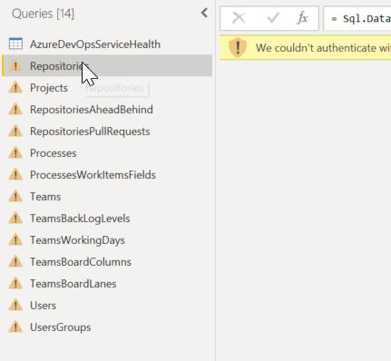
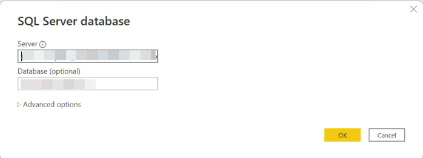
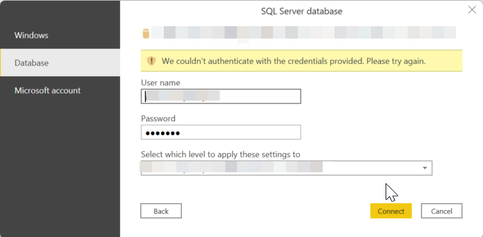

# Azure DevOps Management Reports
Data extraction and Power BI report that generate management informations about your Azure DevOps organization.


### Azure DevOps Management Report
This project aims to extract management information (Processes, Projects, Repos, Build and Release Defintions, etc.) from Azure DevOps and present it in a single report.

## Get started - Configure Azure DevOps Management Reports

### Create Azure SQL Database
This extraction needs it to be created a Azure SQL Server and Database to store the information extracted by running the PowerShell scripts

This tutorial helps you to create this database:
[Quickstart: Create an Azure SQL Database single database](https://docs.microsoft.com/en-us/azure/azure-sql/database/single-database-create-quickstart?tabs=azure-portal)

|Database Name|
|---|
|azuredevopsreports|

After creating the database, please access SQL Server Management Studio, connect **azuredevopsreports** database and run **01_CreateTables.sql** contained in the **SQLScripts** folder. This file will create the database tables.

```sql
01_CreateTables.sql
```

### Run PowerShell Scripts
>After creating the database, you will need three information to run scripts:

>- Name of Azure DevOps organization
>- Create PAT (Personal Access Token) on your Azure DevOps organization. To create this PAT, access [Create a PAT](https://docs.microsoft.com/en-us/azure/devops/organizations/accounts/use-personal-access-tokens-to-authenticate?view=azure-devops&tabs=Windows#create-a-pat) link. Important: Give a **Full access** scope to this PAT.
>- Get the Connection String from the database created in the previous step

Please clone this repository and access AllReports\PowerShell folder

```PowerShell
cd .\AllReports\PowerShell
```

After that, executes a file **Process.ps1**
```powershell
.\Processes.ps1 -PAT {{PAT}} -Organization {{Organization}}  -Connstr {{Connection string from database}}
```

At the end of execution, a log file will be generated showing all the data extraction performed.

### Configure Power BI Report
- Open **OneReportToRuleThemAll.pbix** file which is located in the **PowerBI** folder. On the **Home** tab, select **Transform data**:
  
  

- On **Queries** pane, select **Repositories** table:
  
  
  
- On **Query Settings** pane, click on **configurations**

  


- On **SQL Server database**, enter the database server name and the database name.
  - Server: {{mysqlserver}}.database.windows.net:1433
  - Database (optional): azuredevopsreports
  
  


- On **SQL Server database**, Database tab, enter user name and password to access SQL Database:
  
  

- On **Home** tab, Click on **Close & Apply**

### Access Report
After Power BI configuration, you will have access to a lot of information about your Azure DevOps organization.


